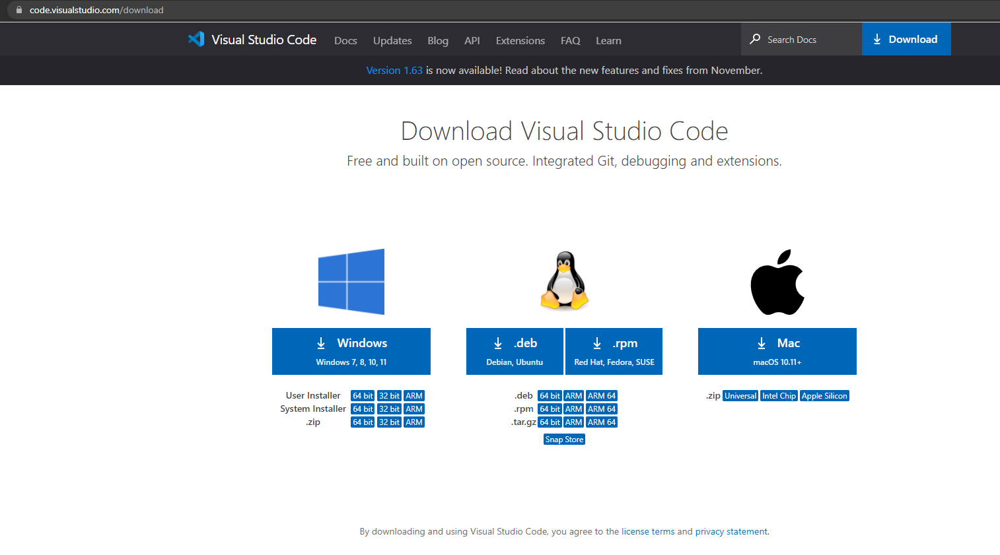
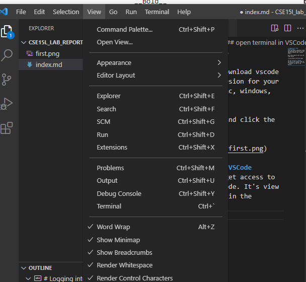
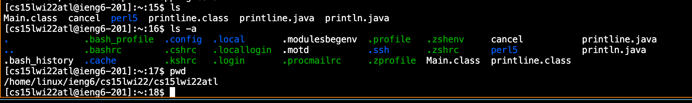
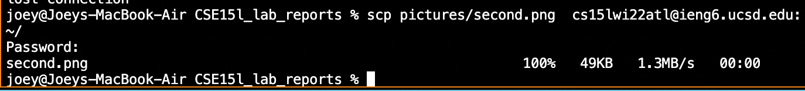
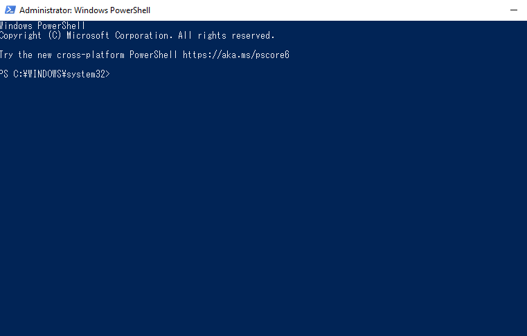
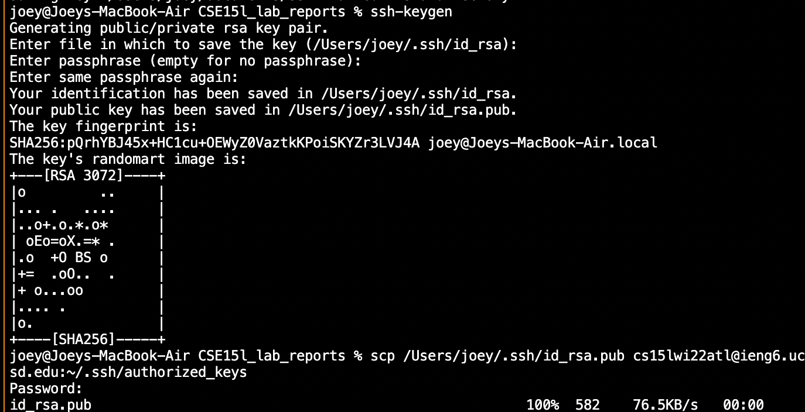
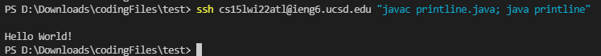

# Logging into ieng6
## get VSCode
first you need to download vscode and download the version for your specific machine (mac, windows, linux.)

go to this website and click the right button

[vscode link](https://code.visualstudio.com/download)



## open terminal in VSCode
now you'll want to get access to the terminal in VSCode. It's view > terminal, as seen in the picture.




## ssh into your account
use the ssh command and post your account@ieng6.ucsd.edu afterwards to log into your account. Then type in your password.

```
ssh

```


## try some commands
try out some of the cool commands linux has to offer.

```
ls
ls-a
ls-lat
pwd
cd
grep

```



## scp a file
you can secure copypaste a file from your computer to the ieng6 server by using the scp command. Take any file and do so. You should not be signed in while doing so. This process took around 1:32 and roughly 72 keystrokes.
```
scp pictures/second.png  cs15lwi22atl@ieng6.ucsd.edu:~/

```



## set up ssh-keys
ssh keys are helpful in that they make it so you don't have to type in a password everytime you want to do a command from your computer to ieng6. Follow the instructions at this link in the admin powershell. open it with windows+x menu.
[Link](https://docs.microsoft.com/en-us/windows-server/administration/openssh/openssh_keymanagement#user-key-generation)

powershell:


ssh keys set up:





## Even cooler running
now scp a .java file. You can use semicolons to type multiple commands into the commandline at once, speeding up your remote coding. try compiling and running your scp'd program in one submission. The most pleasant format I found was copypasting the ssh cs15lwi22@ieng6.ucsd.edu "javac printline.java; java printline" command directly after an scp command. It allowed me to compile and run the commands with 2 copy paste inputs, scp and ssh. It takes around 3-7 seconds to run the combo. 

```
scp printline.java cs15lwi22atl@ieng6.ucsd.edu:~/

ssh cs15lwi22@ieng6.ucsd.edu "javac printline.java; java printline"

```



