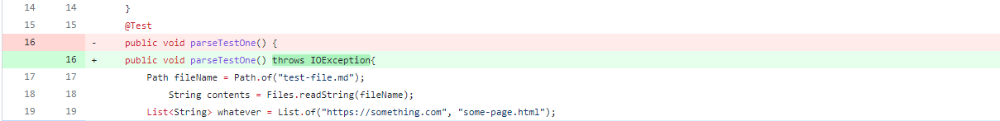
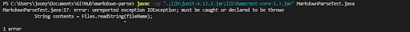
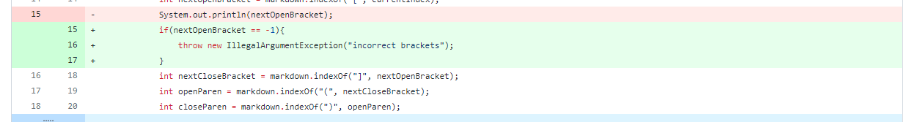
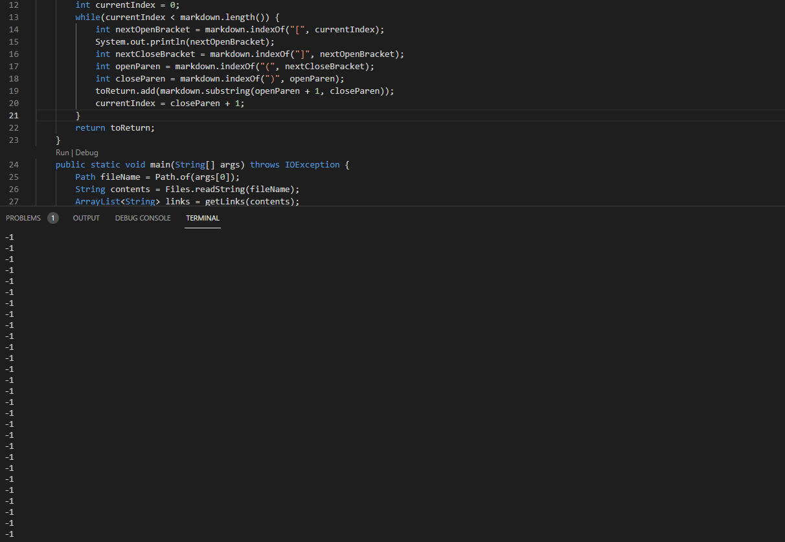
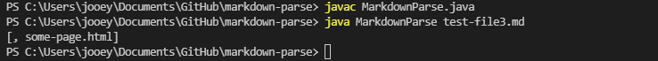
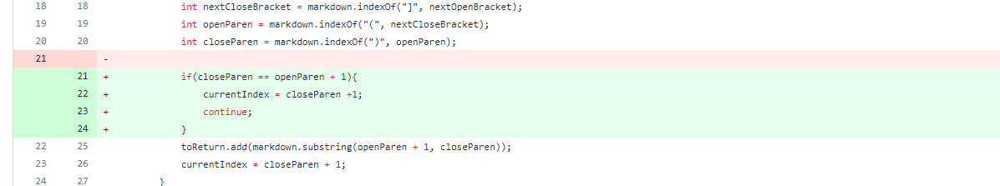

# Debugging Code

## First Problem
added a throws IOException to the function parseTestOne

[error causing file](testfiles/test-file4.md)

This error was the reason for the change to the test.

The symptom that alerted me to the bug was that the tester file did not compile. The bug that was the cause of the problem was the lack of a throws IOException statement in the function header. The input did not seem to be the problem here, as there was no input that would allow our code to compile. 

## Second Problem
Another fix.

We were getting stuck in an infinite loop when incorrect input was given. This was the error that caused us to add a illegalargument exception.

[error causing file](testfiles/test-file2.md)

The symptom is that our code was getting stuck, printing out the same thing over and over again. The bug causing this was that we didn't consider a scenario where input didn't match expected input, so we did not add any way to catch errors. Now if someone doesn't have brackets in their input we won't get stuck in an infinite loop.

## Third Problem

[error causing file](testfiles/test-file3.md)

The symptom is we were printing out empty links in our list, which is unnecessary. The bug was that we had no way to check if a link was empty, so that when we passed in both an empty link and a full one both were added to the list. This fix checks to see if the passed in link is empty and if so ignores it.  