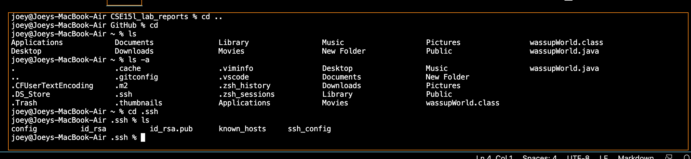
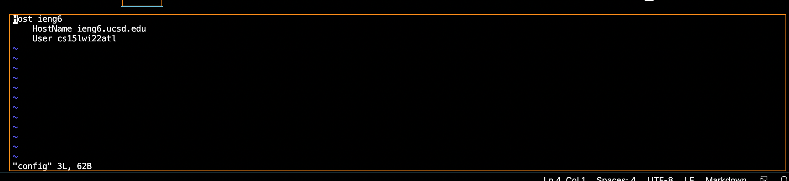
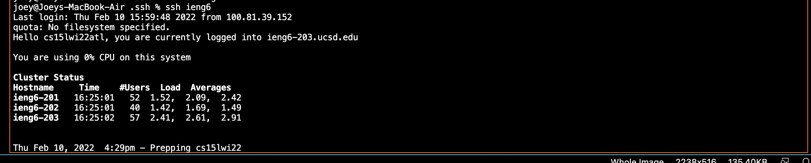

# ssh Streamlined ssh Config

## ssh config
location of the config file

I used vim to edit the config file since I couldn't access it
through the file system.

## ssh using new name

Here I ssh using the new shortcut name for my account.

## scp using new name

Here I scp a file using the new shortcut name for my account.

