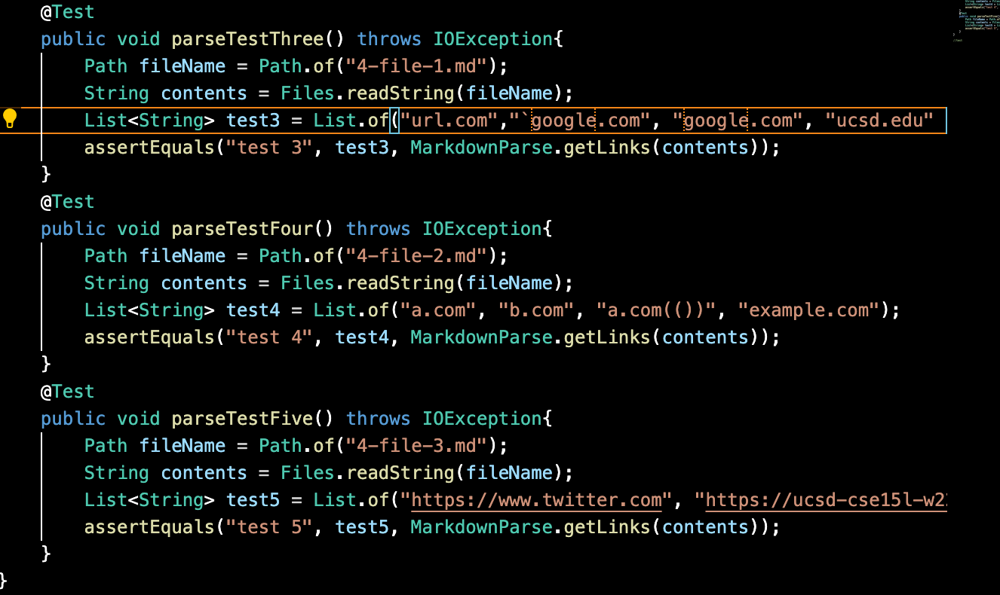
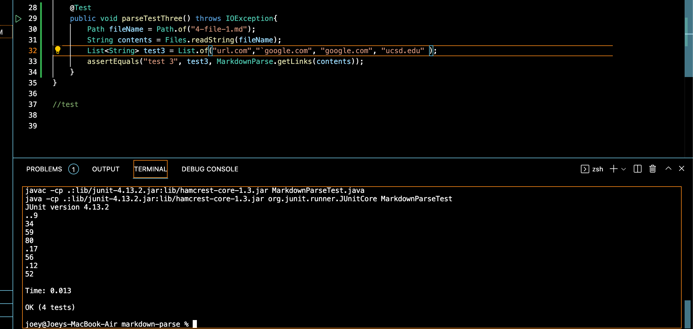
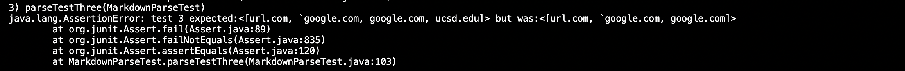
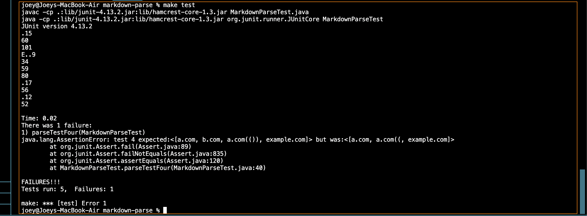
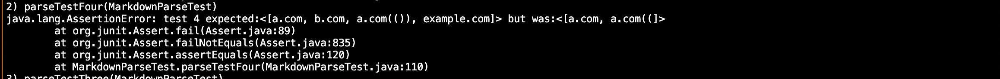
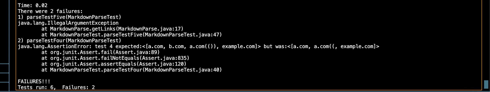
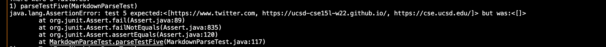

# Lab 4

## Links to Repos

[Mine](https://github.com/JoeyEdmo/markdown-parse)

[Other Guy's](https://github.com/BenX-64/markdown-parse)

## all tests written

these are all the tests I wrote. 3 tests the 1st file, 4 tests the 2nd, 5 tests the third.

## my code test 1

This is my test for the first markdown test for this lab. It passes the test, the links are grabbed correctly.

## other guy test 1

tests fail.

## my code test 2

My test for the second one failed. It does not grab the nested link, and does not get the parenthesis in the a.com(()) link.

## other guy test 2

Fails.

## my code test 3

Code fails, and I throw an invalid argument exception when I shouldn't.

## other guy test 3

Code fails, he doesn't store any links.

## the answers

1. Since my code works for 1 I dont think I need to change anything.

2. My code does not work, and I dont believe I can make a small change to fix it. The nested link would require a lot of changes keeping track of open/closed parenthesis and brackets. On top of that large change, I would also need to keep track of parenthesis in links to fix the a.com(()) link grab, which is another reasonably big change.

3. My code does not work, and I dont believe I can make a small change to fix it. I threw an illegalArg exception to fix a different problem, so now I will need to get rid of that exception, fix that other problem, then fix this one. That's a lot of changes.