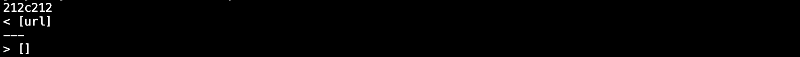

# Lab 5

## explanation
2 differences were found by running diff on 2 different txt files. Txt files were made with this command:

``` bash script.sh > somefile.txt ```

for both my code and the class code.

## difference 1
difference:


expected output:


My code was incorrect. The reason my code was incorrect is I did not take into account the fact that it is in code snippets and should be ignored. There isn't an exact place in my code this fix applies to, since it is something that should be kept track of in my getLinks function. Essentially I should find some way to check if the code is within a code snippet and if so, ignore the code.

In this function:


## difference 2

difference:


expected output:


a link goes through, which means that the class markdown parse is wrong. I believe mine is correct as it grabs the info inside of parenthesis as a link like expected output indicates should happen.

This is where the issue occurs in the class getLinks:


The class code disregards the link as a potential link since it contains a space. Instead of adding it toReturn, it goes into the else statement and continues searching. The actual Markdown believes there is a link there, and does not ignore the link. Therefore a fix has to occur in this link checker.

